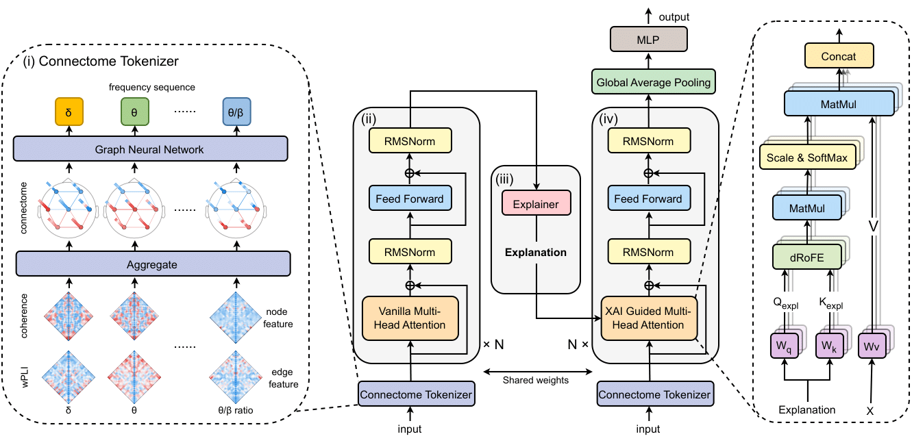

# XAIguiFormer
This is a pytorch implementation of our ICLR 2025 paper [XAIguiFormer: explainable artificial intelligence guided transformer for brain disorder identification](https://openreview.net/forum?id=AD5yx2xq8R).

## Abstract
EEG-based connectomes offer a low-cost and portable method to identify brain disorders using deep learning. With the growing interest in model interpretability and transparency, explainable artificial intelligence (XAI) is widely applied to understand the decision of deep learning models. However, most research focuses solely on interpretability analysis based on the insights from XAI, overlooking XAI’s potential to improve model performance. To bridge this gap, we propose a dynamical-system-inspired architecture, XAI guided transformer (XAIguiFormer), where XAI not only provides explanations but also contributes to enhancing the transformer by refining the originally coarse information in self-attention mechanism to capture more relevant dependency relationships. In order not to damage the connectome’s topological structure, the connectome tokenizer treats the single-band graphs as atomic tokens to generate a sequence in the frequency domain. To address the limitations of conventional positional encoding in understanding the frequency and mitigating the individual differences, we integrate frequency and demographic information into tokens via a rotation matrix, resulting in a richly informative representation. Our experiment demonstrates that XAIguiFormer achieves superior performance over all baseline models. In addition, XAIguiFormer provides valuable interpretability through visualization of the frequency band importance.



## Environment Set Up
```
conda env create -f environment.yaml
conda activate XAIguiFormer
```

## Preparation

## Run

## Citation
If you find our paper/code useful, please consider citing our work:
```
@inproceedings{
guo2025XAIguiFormer,
title={XAIguiFormer: explainable artificial intelligence guided transformer for brain disorder identification},
author={Hanning Guo, Farah Abdellatif, Yu Fu, N. Jon Shah, Abigail Morrison, Jürgen Dammers},
booktitle={The Thirteenth International Conference on Learning Representations},
year={2025},
url={https://openreview.net/forum?id=AD5yx2xq8R}
}
```
